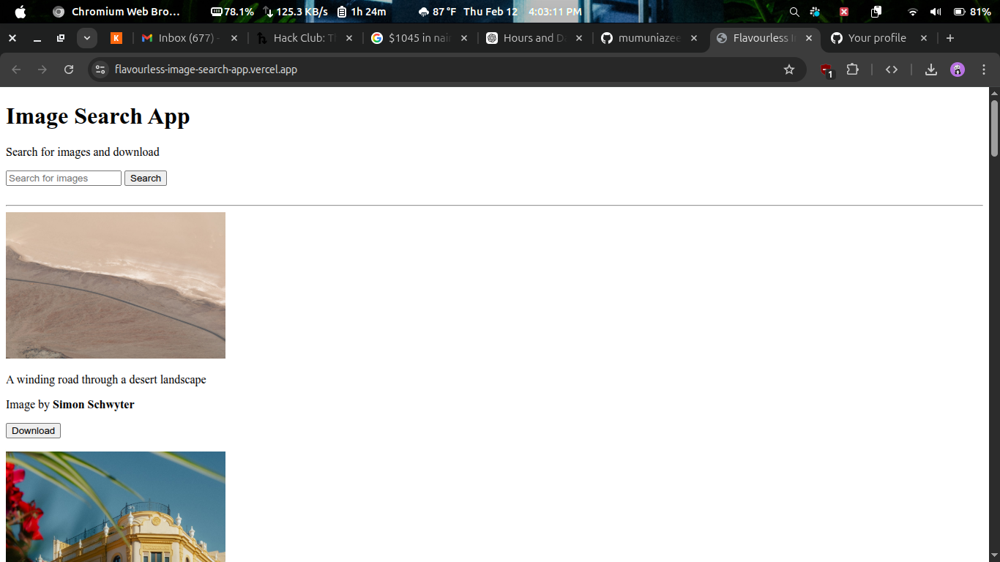

# 🖼️ Flavourless Image Search App

A minimalist, high-performance image search application built for the **[Hack Club Flavourless Hack](https://flavourless.hackclub.com)**.

The challenge: Build a functional application using **only raw HTML and JavaScript**, strictly avoiding any CSS styling.



## 🚀 Features

- **Real-time Image Search**: Find high-quality images via the Unsplash API.
- **Random Discovery**: Starts with a curated selection of random images.
- **Instant Downloads**: One-click download directly to your device.
- **Infinite Browsing**: "Load More" functionality to keep the inspiration flowing.
- **Ultra Minimalist**: Zero CSS, zero bloat—just pure functionality.

## 🛠️ Tech Stack

- **HTML5**: Semantics and structure.
- **JavaScript (ES6+)**: Logic, API integration, and DOM manipulation.
- **Unsplash API**: Powering the image database.
- **Vite**: Modern frontend tooling for development.

## 📂 Project Structure

```text
├── asset/          # Project assets (screenshot, etc.)
├── public/         # Static assets
├── src/            # JavaScript source files
│   ├── imageDownloader.js
│   ├── imageLoader.js
│   ├── main.js
│   ├── renderImageHtml.js
│   └── searchImages.js
├── index.html      # Main entry point
└── package.json    # Dependencies and scripts
```

## ⚙️ Setup & Installation

1. **Clone the repository**:

   ```bash
   git clone https://github.com/yourusername/flavourless-image-search-app.git
   cd flavourless-image-search-app
   ```

2. **Install dependencies**:

   ```bash
   npm install
   ```

3. **Set up Environment Variables**:
   Create a `.env` file in the root directory and add your Unsplash Access Key:

   ```env
   VITE_UNSPLASH_ACCESS_KEY=your_access_key_here
   ```

4. **Run the development server**:

   ```bash
   npm run dev
   ```

## 🤝 Contributing

Contributions are welcome! If you want to see the journey of building this or want to contribute, join the channel **#flavourless-image-search-app** on the Hack Club Slack.

Built with ❤️ by **AzCodes**.
